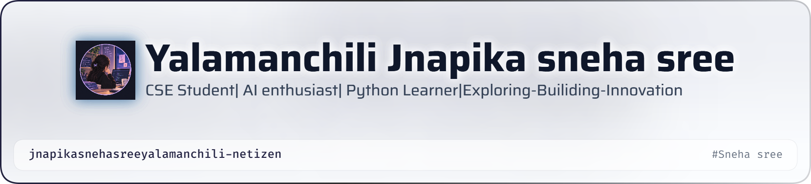

<picture>
  <source media="(prefers-color-scheme: dark)" srcset="./header-dark.png">
  <source media="(prefers-color-scheme: light)" srcset="./header-light.png">
  
</picture>

# 👋 Hi, I'm Jnapika Sneha Sree!

### 💻 CSE Student | Python Learner | Aspiring Software Developer

Welcome to my GitHub profile! 🚀
I'm a Computer Science and Engineering student who enjoys learning programming, exploring new technologies, and building projects that turn ideas into reality.

---

## 🌸 About Me

* 🎓 B.Tech Computer Science & Engineering Student
* 💻 Currently learning **Python, C, Data Structures & Web Development**
* 🌱 Exploring **AI, Machine Learning and Deep Learning**
* 🚀 Interested in building creative and useful projects
* 🧠 Always curious to learn new technologies
* 🎯 Working towards becoming a skilled software developer
* 🎵 I enjoy listening to music in my free time

---

## 🛠️ Skills & Technologies

### 👩‍💻 Programming

`Python` `C` `HTML` `CSS` `JavaScript`

### 📚 Currently Learning

`Data Structures` `DBMS` `Machine Learning` `Deep Learning`

### 🔧 Tools

`Git` `GitHub` `VS Code`

---

## 🚀 Projects

Here are some of the projects I'm working on and exploring:

* 🌐 **NEXORA** – Interactive learning platform
* 🧠 **Deep Learning Learning Module** – Educational web-based learning experience
* 🛡️ **PhishLens** – AI-powered email threat detection concept
* 💻 Python & C programming projects
* 📊 Data Structures and algorithm implementations

More projects coming soon... ✨

---

## 📈 My Goals

🎯 Improve my programming skills
🎯 Build real-world projects
🎯 Learn AI & Machine Learning
🎯 Contribute to open-source projects
🎯 Become a confident software developer

---

## 🌱 Learning Journey

> **"Learn. Build. Fail. Improve. Repeat."**

Every project is an opportunity to learn something new.
I'm continuously improving my skills one step at a time. 🚀

---

## 🤝 Let's Connect

I'm always interested in learning, collaborating, and connecting with fellow developers and students.

⭐ If you find my projects interesting, feel free to explore my repositories!

### 💜 Thanks for visiting my profile!

**Keep Learning • Keep Building • Keep Growing 🚀**
